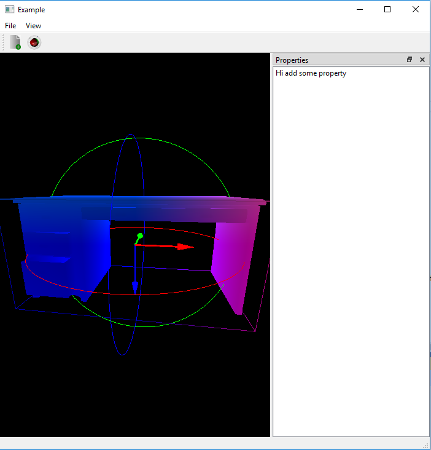

# 10_Camera_Perspective
Use Mouse Wheel to zoom in and out

Camera Class:
  1) Camera position and orientation are set in camera class
  2) LookAt function is used in camera class to calculate the configuration of camera
  3) Perspective projection matrix is set in resizeGL
  4) MouseWheelEvent is used to change the camera position
    a) This give zoom in and zoom out effect
  5) In fragment shader color is changed, given gl_position as the color
  
Output Image:

